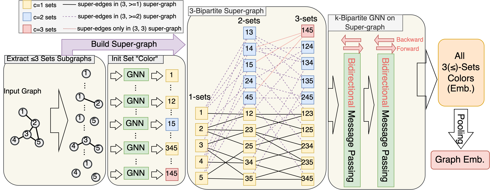

# (k,c)(≤)-SetGNN
Official code for [A Practical, Progressively-Expressive GNN (NeurIPS 2022)](https://arxiv.org/abs/2210.09521)


## Setup 
```
# params
ENV=pyg
CUDA=11.1
TORCH=1.9.1
PYG=2.0.1

# create env 
conda create --name $ENV python=3.9 -y
conda activate $ENV

# install pytorch 
conda install pytorch=$TORCH torchvision torchaudio cudatoolkit=$cuda -c pytorch -c nvidia -y

# install pyg2.0
conda install pyg=$PYG -c pyg -c conda-forge -y

# install ogb 
pip install ogb

# install rdkit
conda install -c conda-forge rdkit -y

# update yacs and tensorboard
pip install yacs==0.1.8 --force  # PyG currently use 0.1.6 which doesn't support None argument. 
pip install tensorboard
pip install matplotlib
```
## Code Structure and Contents

``core/`` contains all source code.   
``train/`` contains all scripts for available datasets.  

* ``core/config.py`` contains all hyperparameters, with explanation in comments. Important parameters are marked with [main param]. 

* Extracting all (k,c)(<=)-sets is implemented as a data transform operator in PyG, and each set $s$ is viewed as induced subgraph $G[s]$ which is used by the model.  See ``core/transform.py``. The transform layer will build the mapping between original graph and all its subgraphs for nodes and edges.
  * the function ``extend_to_kplus1`` is the implementation of Algorithm 1. 
  * the function ``build_components_graph_parallel`` is designed to build the connection of all sets with larger than 1 compoenent to all single-component sets. See Algorithm 2 in the paper. 

* All models are implemented under ``core/model``. There are three models available
  * ``core/model/gnn.py`` contains the plain message passing based GNN like GIN. 
  * ``core/model/ppgn.py`` contains the implementation of "Probably Powerful Graph Networks", modiified from the official implementation [here](https://github.com/hadarser/ProvablyPowerfulGraphNetworks_torch).
  * ``core/model/setgnn.py`` contains the implementation of `(k,c)(<=)SetGNN` and `(k,c)(<=)SetGNN*`, with its bipartite message passing layers (both original and sequential) implemented in ``core/model/bipartite.py``.
  
* `` core/data_utils/cfi.py`` contains implementataion of [CFI](https://people.cs.umass.edu/~immerman/pub/opt.pdf) graph construction. It is an important category of graphs for verifying k-WL expressivity. We open source it for others to use. There are two versions. One is the original and the other is from Martin Grohe's [paper](https://www.cambridge.org/core/services/aop-cambridge-core/content/view/848E4F828C3DAD6C3D4757B650513578/S0022481215000286a.pdf/pebble-games-and-linear-equations.pdf).
  

## Run (k,c)(≤)SetGNN
```
python -m train.zinc model.num_layers 2 model.num_inners 4 subgraph.kmax 5 subgraph.num_components 1 model.bgnn_type 'Parallel'  device 0 
```

## Run (k,c)(≤)SetGNN*
```
python -m train.zinc model.num_layers 2 model.num_inners 4 subgraph.kmax 5 subgraph.num_components 1 model.bgnn_type 'Sequential'  device 0
```

## Change Aggregation Operations for Biparatite Message Passing 
```
python -m train.zinc model.pools "['add','max']"
python -m train.zinc model.pools "['add']"
```

## Cite
Please cite our paper if you use the code. 

```
@inproceedings{
    zhao2022a,
    title={A Practical, Progressively-Expressive {GNN}},
    author={Lingxiao Zhao and Louis Härtel and Neil Shah and Leman Akoglu},
    booktitle={36th Conference on Neural Information Processing Systems},
    year={2022},
    url={https://openreview.net/forum?id=WBv9Z6qpA8x}
}
```
